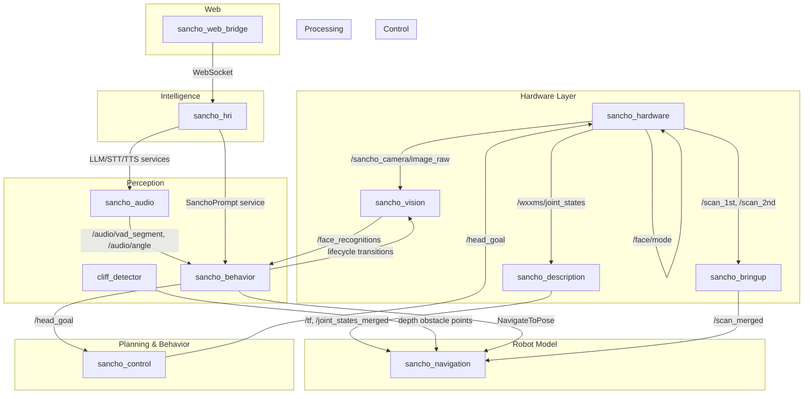

# Sancho Robot — ROS 2 Workspace

**Sancho** is a socially-aware mobile robot built on ROS 2 Humble. It autonomously navigates indoor environments, detects and recognizes people, engages in multi-turn conversations using LLMs, and expresses itself through an animated face and a motorized pan-tilt head.

## Architecture Overview



## Packages

| Package | Role | Build Type |
|---------|------|------------|
| [cliff_detector](src/cliff_detector/) | Depth-based obstacle/cliff detection | `ament_cmake` |
| [sancho_audio](src/sancho_audio/) | Audio capture, VAD, DOA, wake-word, STT relay | `ament_python` |
| [sancho_behavior](src/sancho_behavior/) | High-level FSM orchestrator + BT plugins | `ament_python` + `ament_cmake` (bt_plugins) |
| [sancho_bringup](src/sancho_bringup/) | Top-level launch files and sensor fusion | `ament_python` |
| [sancho_control](src/sancho_control/) | Head tracking (P-control) | `ament_python` |
| [sancho_description](src/sancho_description/) | URDF, meshes, TF broadcasting | `ament_python` |
| [sancho_hardware](src/sancho_hardware/) | Hardware drivers (face LED, head servos, camera/LiDAR wrappers) | `ament_cmake` |
| [sancho_hri](src/sancho_hri/) | LLM, STT, TTS services + conversational AI | `ament_python` |
| [sancho_interfaces](src/sancho_interfaces/) | Custom msgs (33), srvs (31), actions (1) | `ament_cmake` |
| [sancho_lifecycle_utils](src/sancho_lifecycle_utils/) | Automatic lifecycle node configurator | `ament_python` |
| [sancho_navigation](src/sancho_navigation/) | Roaming, CBF safety filter, scan filter, Nav2 configs | `ament_python` |
| [sancho_perception](src/sancho_perception/) | MoveNet body detection, 3D pose estimation, group/person tracking | `ament_python` |
| [sancho_vision](src/sancho_vision/) | Face detection, recognition, tracking, HRI GUI | `ament_python` |
| [sancho_web_bridge](src/sancho_web_bridge/) | WebSocket bridge, REST API, web assistant | `ament_python` |
| [third_party_pkgs](src/third_party_pkgs/) | Vendored dependencies (ByteTrack, Astra, Interbotix, etc.) | Mixed |

## Quick Start

```bash
# 1. Install ROS 2 Humble and source it
source /opt/ros/humble/setup.bash

# 2. Install dependencies
cd sancho_ws
rosdep install --from-paths src --ignore-src -r -y

# 3. Build
colcon build --symlink-install

# 4. Source the workspace
source install/setup.bash

# 5. Launch the full robot
ros2 launch sancho_bringup sancho_full_bringup.launch.py
```

## Key Data Flows

1. **Perception → Behavior**: Camera images flow through `sancho_vision` (face detection/recognition) and `sancho_audio` (VAD/DOA), producing structured face identities and audio angles that feed the `sancho_behavior` orchestrator.

2. **Behavior → Navigation**: The orchestrator generates waypoints for Nav2 via `NavigateToPose`, while the CBF safety filter in `sancho_navigation` ensures collision-free motion.

3. **Behavior → HRI**: During social interactions, the behavior layer triggers `sancho_hri` services (LLM prompts, TTS synthesis) to engage in natural conversation, while controlling the robot's animated face and head orientation.

4. **Web → Robot**: External web clients connect through `sancho_web_bridge` to monitor the robot's state, view camera feeds, and interact with the conversational assistant remotely.
